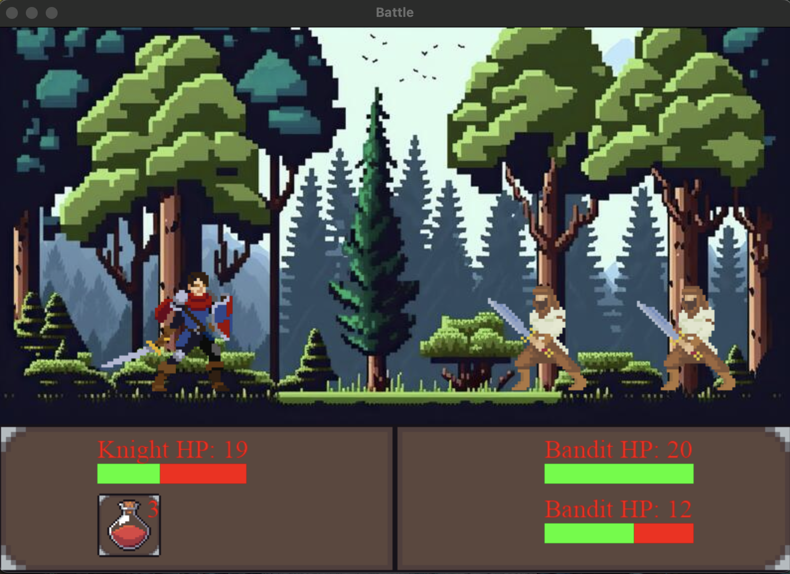
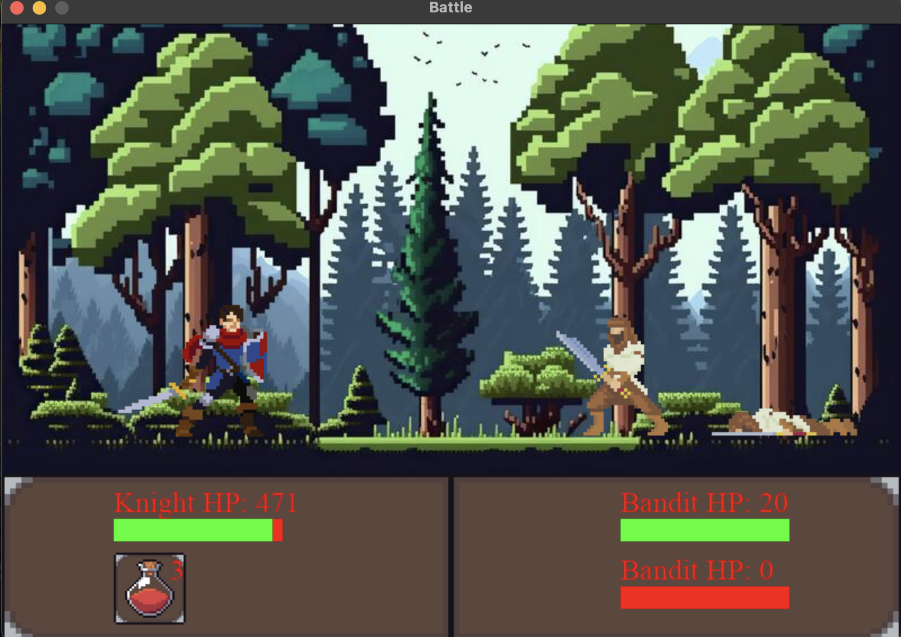

# 🏰 RPG Game in Pygame

## 📜 Overview
This project is a simple turn-based RPG game developed using Python's Pygame library. Players control a knight character and engage in combat against bandit enemies. The game features basic mechanics such as attacking, healing with potions, and a health bar display.
## 📸 Screenshots
Here are some screenshots from the game:


*Knight attacking a bandit*


*Bandit dead*


## 🌟 Features
- ⚔️ **Turn-Based Combat**: Players and enemies take turns to attack or heal.
- ❤️ **Health Management**: Each character has a health bar that displays current health.
- 🧪 **Potion Usage**: Players can use potions to heal themselves during battles.
- 🎮 **Animations**: Characters have animations for idle, attack, hurt, and death states.

⚙️ Game Mechanics

Characters: The game includes a knight and multiple bandits. Each character has attributes such as name, max health points (HP), current HP, strength, and the number of potions available.
Combat System: Players can choose to attack an enemy or use a potion. The damage dealt is randomized within a range based on the character's strength.
Game Over Conditions: The game ends when either the knight or all bandits are defeated.
🎮 Controls

Click on a bandit to attack.
Use the potion button to heal yourself.
🎨 Assets

The game includes various images for backgrounds, character sprites, and icons for potions and actions. Ensure that all image files are placed in the correct directories as specified in the code.


## 🛠️ Requirements
To run this game, you need:
- Python 3.x
- Pygame library

You can install Pygame using pip:

```bash
pip install pygame
